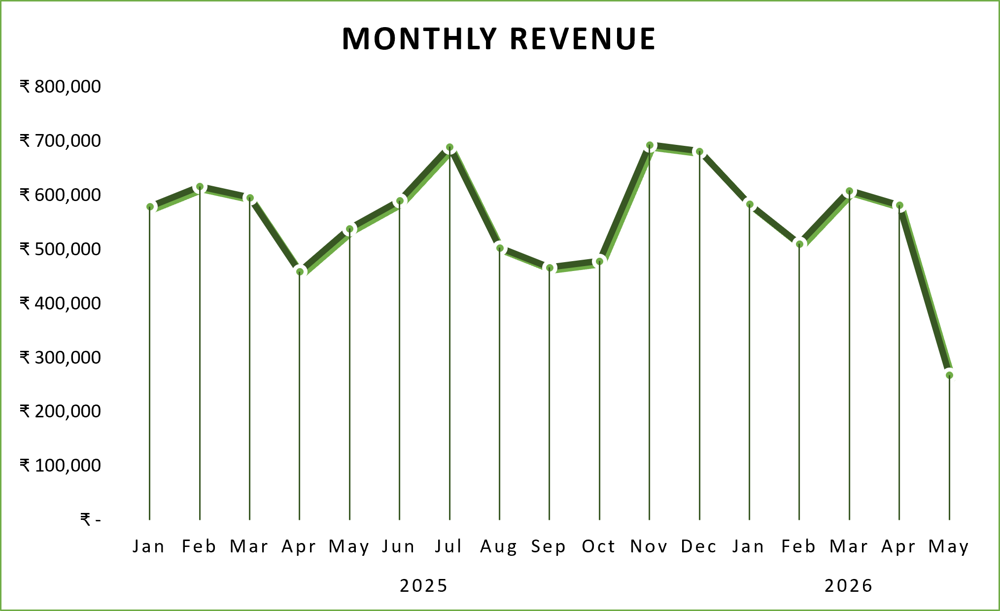
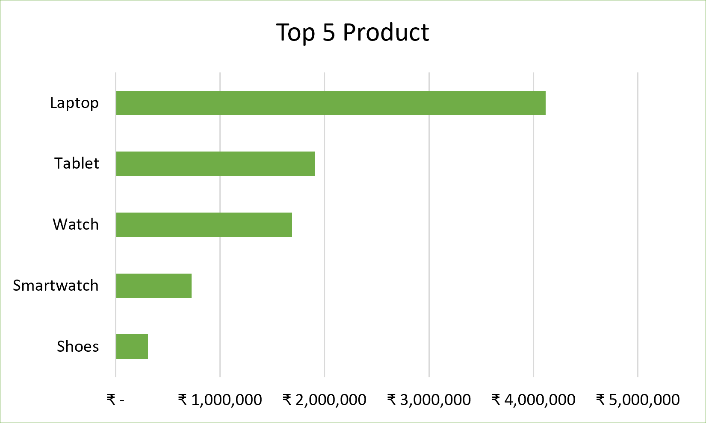
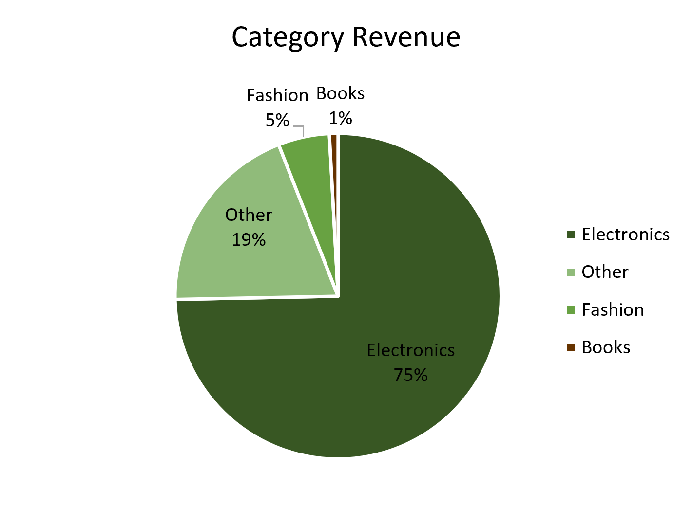
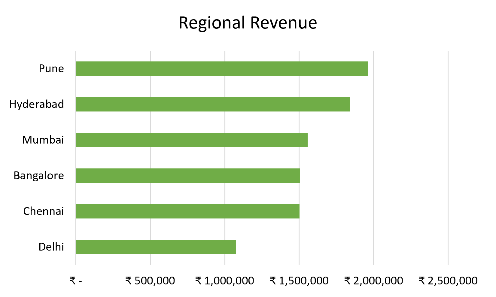
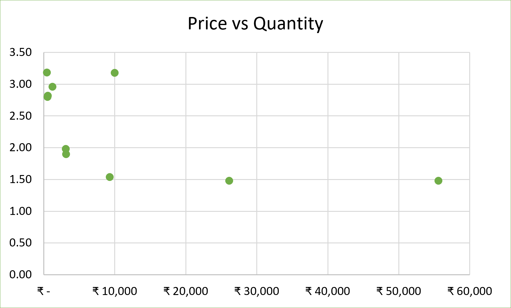
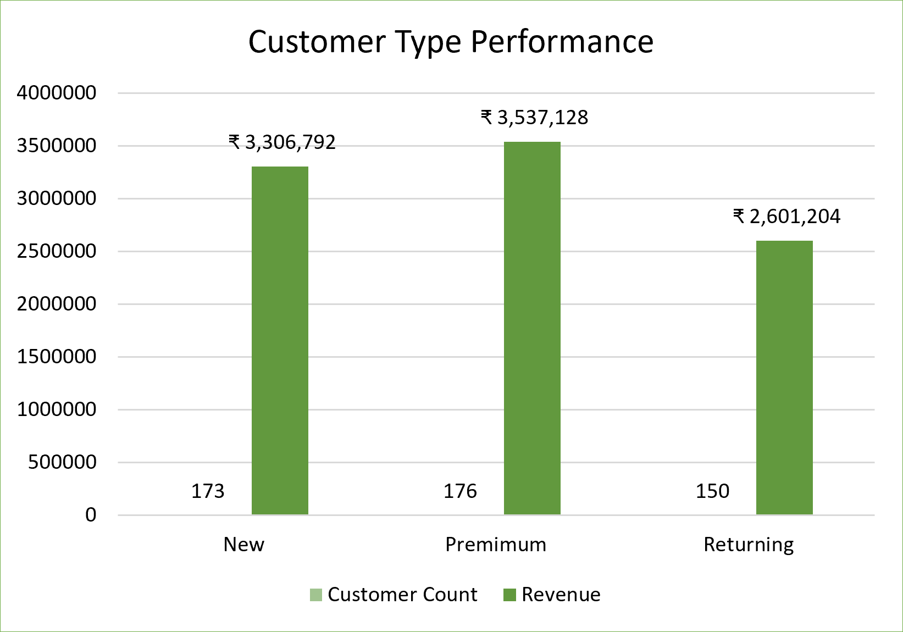

# E-Commerce Sales & Customer Analytics Insights

## Dashboard Overview

- **Total Sales:** ₹9.45M
- **Total Quantity:** 1163
- **Avg Order Value:** ₹18.93K
- **Total Customer:** 499

---

## 1. Which months generate the highest and lowest sales?

### Finding

> **November 2025 generated the highest revenue at ₹693,532, while May 2026 generated the lowest revenue at ₹268,056.**

### Insight

> **Sales changed a lot between months, with November generating about 2.6 times more revenue than May.**

### Recommendation

> **The business should compare what happened in the high-sales months with the low-sales months to identify patterns that could help improve sales during weaker months.**

---

## 2. Which products generate the most sales?

### Finding

> **Laptop generated the highest revenue at ₹4,118,275.**

### Insight

> **Laptop is an important contributor to the business's overall revenue.**

### Recommendation

> **The business should keep laptops well-stocked and analyze what makes this product perform well so similar opportunities can be identified.**

> ⚠️ **Note:** We don't say *"Laptop is the most popular product"* because we measured **revenue**, not popularity.

---

## 3. Which categories generate the most sales?

### Finding

> **Electronics generated the highest revenue at ₹7,054,016.**

### Insight

> **Electronics is the strongest revenue-generating category and makes a large contribution to overall sales.**

### Recommendation

> **The business should continue monitoring Electronics performance and identify which products within this category contribute the most revenue.**

---

## 4. Which regions generate the most sales?

### Finding

> **Pune generated the highest revenue at ₹1,962,356.**

### Insight

> **Pune is the strongest-performing region based on revenue.**

### Recommendation

> **The business should examine which products and categories are driving Pune's strong performance and use those findings when evaluating opportunities in other regions.**

---

## 5. Is there a relationship between product price and quantity purchased?

### Finding

> **Higher-priced products generally have lower average quantities purchased. For example, laptops have an average price of ₹55,565.54 and an average quantity of 1.48, while Water Bottles have an average price of ₹442.27 and an average quantity of 3.18.**

### Insight

> **Customers tend to buy fewer units of higher-priced products and more units of lower-priced products in this dataset.**

### Recommendation

> **The business could test bundles or quantity-based offers for lower-priced products while monitoring how customers respond to different price points.**

> ⚠️ **Important:** This shows a **pattern**, not proof that price causes customers to buy less.

---

## 6. Which customer type generates the most orders/sales?

### Finding

> **Premium customers generated the highest revenue at ₹3,537,128 from 176 orders. New customers generated ₹3,306,792 from 173 orders, while Returning customers generated the lowest revenue at ₹2,601,204 from 150 orders.**

### Insight

> **Premium customers are the strongest revenue-generating customer group, while Returning customers contribute the least revenue.**

### Recommendation

> **The business should focus on retaining Premium customers and investigate how to increase revenue from Returning customers through higher order values or more frequent purchases.**

---

## 7. Which products or categories are most popular within each customer type?

Your query identifies the **highest-revenue product for each customer type**.

The results show that **Laptop / Electronics** was the top performer for:

* Premium customers
* New customers
* Returning customers

### Finding

> **Laptop, in the Electronics category, is the highest revenue-generating product for Premium, New, and Returning customers.**

### Insight

> **Laptop is performing strongly across all three customer groups, making it an important product for different types of customers.**

### Recommendation

> **The business should continue monitoring laptop sales across customer types and explore related Electronics products that could be promoted alongside laptops.**

---

## 8. Which payment methods are most used, and which generate the most revenue?

### Finding

> **UPI is the most-used payment method by order count, while Cash on Delivery generates the highest revenue at ₹3,634,879.**

### Insight

> **The payment method used most often is not the payment method generating the most revenue. This means order volume and revenue performance differ across payment methods.**

### Recommendation

> **The business should monitor both payment usage and revenue when evaluating payment methods and investigate why Cash on Delivery generates higher revenue despite having fewer orders than UPI.**